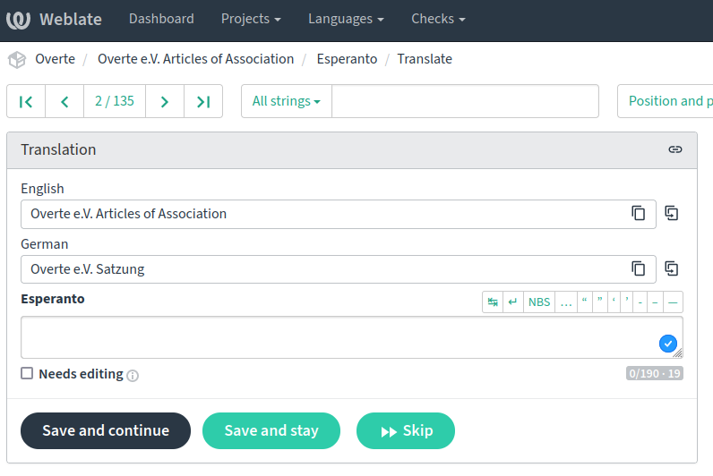

## How to build this documentation:

1. Install Sphinx. For example via pip3 `pip3 install Sphinx`
2. Build the documentation in the source language `make singlehtml`
3. Build the translated documentation `make SPHINXOPTS="-Dlanguage=en" singlehtml`

## Update english translation:

1. `make gettext`
2. `sphinx-intl update -l en`
3. Edit the translation .po files with an editor like Poedit.
4. Build if you want to see your changes.

## Translate

You can help provide translations via [Weblate](https://weblate.overte.org/projects/overte/Overte-e-V-Articles-of-Association/).
Keep in mind that you can choose a "secondary language" [in your profile](https://weblate.overte.org/accounts/profile/).
This allows translating from a translation instead of directly from German. See the example below.

Please contact Julian Groß or open an issue if you want to translate to a language that is not in the system yet.

## Prebuild documentation:

You can look at this document without needing to build it yourself.
Updates are automatically built here:
German https://satzung.overte.org/de/
English https://satzung.overte.org/en/

## Add new languages

Generate the new language strings (see operating system specific instructions above):
- `make gettext`
- `sphinx-intl update -l xx` (xx being the sphinx language code)

New languages need to be manually added in a number of locations, so the users can select between them and they can be automatically deployed.
The locations include:
- https://readthedocs.org/projects/buyanvr-organizational-code-draft/
- https://overte.org/overte_ev.html#articles-of-association
